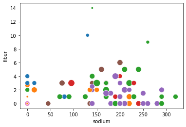
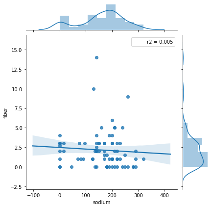
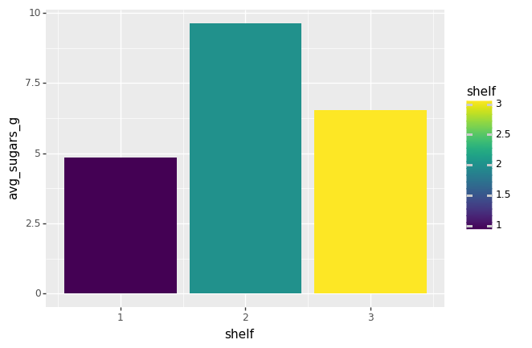
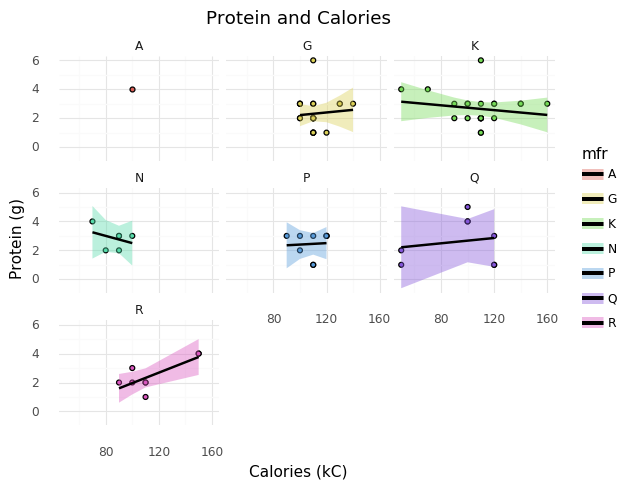

# HW 1 - Visualizing Cereals Dataset
###### Elmer Camargo


```python
import warnings
warnings.filterwarnings('ignore')

import pandas as pd
import numpy as np
from plotnine import *
from plotnine.data import mtcars
import seaborn as sns
from scipy import stats

get_ipython().run_line_magic('matplotlib', 'inline')

def r2(x, y):
    return stats.pearsonr(x, y)[0] ** 2
```


```python
cereal = pd.read_csv("data\cereal.csv")
cereal.head()
```


<div>
<style scoped>
    .dataframe tbody tr th:only-of-type {
        vertical-align: middle;
    }

    .dataframe tbody tr th {
        vertical-align: top;
    }

    .dataframe thead th {
        text-align: right;
    }
</style>
<table border="1" class="dataframe">
  <thead>
    <tr style="text-align: right;">
      <th></th>
      <th>name</th>
      <th>mfr</th>
      <th>type</th>
      <th>calories</th>
      <th>protein</th>
      <th>fat</th>
      <th>sodium</th>
      <th>fiber</th>
      <th>carbo</th>
      <th>sugars</th>
      <th>potass</th>
      <th>vitamins</th>
      <th>shelf</th>
      <th>weight</th>
      <th>cups</th>
      <th>rating</th>
    </tr>
  </thead>
  <tbody>
    <tr>
      <td>0</td>
      <td>100%_Bran</td>
      <td>N</td>
      <td>C</td>
      <td>70</td>
      <td>4</td>
      <td>1</td>
      <td>130</td>
      <td>10.0</td>
      <td>5.0</td>
      <td>6.0</td>
      <td>280.0</td>
      <td>25</td>
      <td>3</td>
      <td>1.0</td>
      <td>0.33</td>
      <td>68.402973</td>
    </tr>
    <tr>
      <td>1</td>
      <td>100%_Natural_Bran</td>
      <td>Q</td>
      <td>C</td>
      <td>120</td>
      <td>3</td>
      <td>5</td>
      <td>15</td>
      <td>2.0</td>
      <td>8.0</td>
      <td>8.0</td>
      <td>135.0</td>
      <td>0</td>
      <td>3</td>
      <td>1.0</td>
      <td>1.00</td>
      <td>33.983679</td>
    </tr>
    <tr>
      <td>2</td>
      <td>All-Bran</td>
      <td>K</td>
      <td>C</td>
      <td>70</td>
      <td>4</td>
      <td>1</td>
      <td>260</td>
      <td>9.0</td>
      <td>7.0</td>
      <td>5.0</td>
      <td>320.0</td>
      <td>25</td>
      <td>3</td>
      <td>1.0</td>
      <td>0.33</td>
      <td>59.425505</td>
    </tr>
    <tr>
      <td>3</td>
      <td>All-Bran_with_Extra_Fiber</td>
      <td>K</td>
      <td>C</td>
      <td>50</td>
      <td>4</td>
      <td>0</td>
      <td>140</td>
      <td>14.0</td>
      <td>8.0</td>
      <td>0.0</td>
      <td>330.0</td>
      <td>25</td>
      <td>3</td>
      <td>1.0</td>
      <td>0.50</td>
      <td>93.704912</td>
    </tr>
    <tr>
      <td>4</td>
      <td>Almond_Delight</td>
      <td>R</td>
      <td>C</td>
      <td>110</td>
      <td>2</td>
      <td>2</td>
      <td>200</td>
      <td>1.0</td>
      <td>14.0</td>
      <td>8.0</td>
      <td>NaN</td>
      <td>25</td>
      <td>3</td>
      <td>1.0</td>
      <td>0.75</td>
      <td>34.384843</td>
    </tr>
  </tbody>
</table>
</div>


```python
cereal.info()
cereal.isnull().sum()
```

    <class 'pandas.core.frame.DataFrame'>
    RangeIndex: 77 entries, 0 to 76
    Data columns (total 16 columns):
    name        77 non-null object
    mfr         77 non-null object
    type        77 non-null object
    calories    77 non-null int64
    protein     77 non-null int64
    fat         77 non-null int64
    sodium      77 non-null int64
    fiber       77 non-null float64
    carbo       76 non-null float64
    sugars      76 non-null float64
    potass      75 non-null float64
    vitamins    77 non-null int64
    shelf       77 non-null int64
    weight      77 non-null float64
    cups        77 non-null float64
    rating      77 non-null float64
    dtypes: float64(7), int64(6), object(3)
    memory usage: 9.8+ KB
    


    name        0
    mfr         0
    type        0
    calories    0
    protein     0
    fat         0
    sodium      0
    fiber       0
    carbo       1
    sugars      1
    potass      2
    vitamins    0
    shelf       0
    weight      0
    cups        0
    rating      0
    dtype: int64


```python
cereal[cereal.isna().any(axis=1)]
```


<div>
<style scoped>
    .dataframe tbody tr th:only-of-type {
        vertical-align: middle;
    }

    .dataframe tbody tr th {
        vertical-align: top;
    }

    .dataframe thead th {
        text-align: right;
    }
</style>
<table border="1" class="dataframe">
  <thead>
    <tr style="text-align: right;">
      <th></th>
      <th>name</th>
      <th>mfr</th>
      <th>type</th>
      <th>calories</th>
      <th>protein</th>
      <th>fat</th>
      <th>sodium</th>
      <th>fiber</th>
      <th>carbo</th>
      <th>sugars</th>
      <th>potass</th>
      <th>vitamins</th>
      <th>shelf</th>
      <th>weight</th>
      <th>cups</th>
      <th>rating</th>
    </tr>
  </thead>
  <tbody>
    <tr>
      <td>4</td>
      <td>Almond_Delight</td>
      <td>R</td>
      <td>C</td>
      <td>110</td>
      <td>2</td>
      <td>2</td>
      <td>200</td>
      <td>1.0</td>
      <td>14.0</td>
      <td>8.0</td>
      <td>NaN</td>
      <td>25</td>
      <td>3</td>
      <td>1.0</td>
      <td>0.75</td>
      <td>34.384843</td>
    </tr>
    <tr>
      <td>20</td>
      <td>Cream_of_Wheat_(Quick)</td>
      <td>N</td>
      <td>H</td>
      <td>100</td>
      <td>3</td>
      <td>0</td>
      <td>80</td>
      <td>1.0</td>
      <td>21.0</td>
      <td>0.0</td>
      <td>NaN</td>
      <td>0</td>
      <td>2</td>
      <td>1.0</td>
      <td>1.00</td>
      <td>64.533816</td>
    </tr>
    <tr>
      <td>57</td>
      <td>Quaker_Oatmeal</td>
      <td>Q</td>
      <td>H</td>
      <td>100</td>
      <td>5</td>
      <td>2</td>
      <td>0</td>
      <td>2.7</td>
      <td>NaN</td>
      <td>NaN</td>
      <td>110.0</td>
      <td>0</td>
      <td>1</td>
      <td>1.0</td>
      <td>0.67</td>
      <td>50.828392</td>
    </tr>
  </tbody>
</table>
</div>


```python
cereal = cereal.fillna(0)
cereal.describe()
```


<div>
<style scoped>
    .dataframe tbody tr th:only-of-type {
        vertical-align: middle;
    }

    .dataframe tbody tr th {
        vertical-align: top;
    }

    .dataframe thead th {
        text-align: right;
    }
</style>
<table border="1" class="dataframe">
  <thead>
    <tr style="text-align: right;">
      <th></th>
      <th>calories</th>
      <th>protein</th>
      <th>fat</th>
      <th>sodium</th>
      <th>fiber</th>
      <th>carbo</th>
      <th>sugars</th>
      <th>potass</th>
      <th>vitamins</th>
      <th>shelf</th>
      <th>weight</th>
      <th>cups</th>
      <th>rating</th>
    </tr>
  </thead>
  <tbody>
    <tr>
      <td>count</td>
      <td>77.000000</td>
      <td>77.000000</td>
      <td>77.000000</td>
      <td>77.000000</td>
      <td>77.000000</td>
      <td>77.000000</td>
      <td>77.000000</td>
      <td>77.000000</td>
      <td>77.000000</td>
      <td>77.000000</td>
      <td>77.000000</td>
      <td>77.000000</td>
      <td>77.000000</td>
    </tr>
    <tr>
      <td>mean</td>
      <td>106.883117</td>
      <td>2.545455</td>
      <td>1.012987</td>
      <td>159.675325</td>
      <td>2.151948</td>
      <td>14.610390</td>
      <td>6.935065</td>
      <td>96.103896</td>
      <td>28.246753</td>
      <td>2.207792</td>
      <td>1.029610</td>
      <td>0.821039</td>
      <td>42.665705</td>
    </tr>
    <tr>
      <td>std</td>
      <td>19.484119</td>
      <td>1.094790</td>
      <td>1.006473</td>
      <td>83.832295</td>
      <td>2.383364</td>
      <td>4.232257</td>
      <td>4.422840</td>
      <td>71.251147</td>
      <td>22.342523</td>
      <td>0.832524</td>
      <td>0.150477</td>
      <td>0.232716</td>
      <td>14.047289</td>
    </tr>
    <tr>
      <td>min</td>
      <td>50.000000</td>
      <td>1.000000</td>
      <td>0.000000</td>
      <td>0.000000</td>
      <td>0.000000</td>
      <td>0.000000</td>
      <td>0.000000</td>
      <td>0.000000</td>
      <td>0.000000</td>
      <td>1.000000</td>
      <td>0.500000</td>
      <td>0.250000</td>
      <td>18.042851</td>
    </tr>
    <tr>
      <td>25%</td>
      <td>100.000000</td>
      <td>2.000000</td>
      <td>0.000000</td>
      <td>130.000000</td>
      <td>1.000000</td>
      <td>12.000000</td>
      <td>3.000000</td>
      <td>40.000000</td>
      <td>25.000000</td>
      <td>1.000000</td>
      <td>1.000000</td>
      <td>0.670000</td>
      <td>33.174094</td>
    </tr>
    <tr>
      <td>50%</td>
      <td>110.000000</td>
      <td>3.000000</td>
      <td>1.000000</td>
      <td>180.000000</td>
      <td>2.000000</td>
      <td>14.000000</td>
      <td>7.000000</td>
      <td>90.000000</td>
      <td>25.000000</td>
      <td>2.000000</td>
      <td>1.000000</td>
      <td>0.750000</td>
      <td>40.400208</td>
    </tr>
    <tr>
      <td>75%</td>
      <td>110.000000</td>
      <td>3.000000</td>
      <td>2.000000</td>
      <td>210.000000</td>
      <td>3.000000</td>
      <td>17.000000</td>
      <td>11.000000</td>
      <td>120.000000</td>
      <td>25.000000</td>
      <td>3.000000</td>
      <td>1.000000</td>
      <td>1.000000</td>
      <td>50.828392</td>
    </tr>
    <tr>
      <td>max</td>
      <td>160.000000</td>
      <td>6.000000</td>
      <td>5.000000</td>
      <td>320.000000</td>
      <td>14.000000</td>
      <td>23.000000</td>
      <td>15.000000</td>
      <td>330.000000</td>
      <td>100.000000</td>
      <td>3.000000</td>
      <td>1.500000</td>
      <td>1.500000</td>
      <td>93.704912</td>
    </tr>
  </tbody>
</table>
</div>


```python
#g = sns.pairplot(cereal)
```

### Relationship Between Fiber and Sodium

It appears that most cereals with low fiber have mid to high sodium values (150 - 300mg) as well as typically more calories, however there are observations of cereals with both low fiber and low sodium as seen on the left half of the scatterplot. Additionally, it does not seem that sodium and fiber have an immediate relationship based off of the regression plot and r2. 


```python
g = sns.scatterplot(data = cereal,x = 'sodium', y = 'fiber', hue = "mfr", size = "calories",
                   sizes=(20, 200), hue_norm=(0, 7), legend = False)
```





```python
#g = sns.regplot(data = cereal,x = 'sodium', y = 'fiber')
g = sns.jointplot(data = cereal,x = 'sodium', y = 'fiber', kind="reg", stat_func=r2)
```





```python
cereal_bar = cereal.groupby("shelf").agg({"sugars": ["mean", "std", "min"]})
cereal_bar.columns = ["avg_sugars_g", "std", "min"]
cereal_bar["shelf"] = cereal_bar.index #how you grab row names
cereal_bar
```


<div>
<style scoped>
    .dataframe tbody tr th:only-of-type {
        vertical-align: middle;
    }

    .dataframe tbody tr th {
        vertical-align: top;
    }

    .dataframe thead th {
        text-align: right;
    }
</style>
<table border="1" class="dataframe">
  <thead>
    <tr style="text-align: right;">
      <th></th>
      <th>avg_sugars_g</th>
      <th>std</th>
      <th>min</th>
      <th>shelf</th>
    </tr>
    <tr>
      <th>shelf</th>
      <th></th>
      <th></th>
      <th></th>
      <th></th>
    </tr>
  </thead>
  <tbody>
    <tr>
      <td>1</td>
      <td>4.850000</td>
      <td>4.510514</td>
      <td>0.0</td>
      <td>1</td>
    </tr>
    <tr>
      <td>2</td>
      <td>9.619048</td>
      <td>4.128876</td>
      <td>0.0</td>
      <td>2</td>
    </tr>
    <tr>
      <td>3</td>
      <td>6.527778</td>
      <td>3.835817</td>
      <td>0.0</td>
      <td>3</td>
    </tr>
  </tbody>
</table>
</div>


### Good cereals are usually on the 2nd or 3rd shelf

couldnt figure out how to fix legend


```python
(ggplot(cereal_bar, aes( x = "shelf", y = "avg_sugars_g", fill = "shelf")) 
+ geom_bar(stat = "identity"))
```





    <ggplot: (-9223371927783853816)>


## Protein and Calories by Manufacturer


```python
(ggplot(cereal, aes( x = 'calories', y = 'protein'))
       +geom_point(aes(fill = 'mfr'), show_legend = False)
       +stat_smooth(aes(fill = 'mfr'),method = 'lm')
       +facet_wrap('~mfr')
       +labs(x = "Calories (kC)", y = "Protein (g)", title = "Protein and Calories")
       +theme_minimal())
```





    <ggplot: (-9223371927783454356)>


